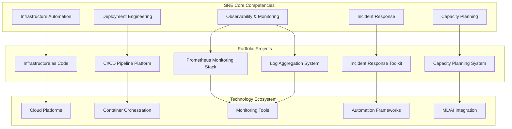

# 👋 Hi, I'm Olaitan Ojo - Site Reliability Engineer

  

## 🚀 Site Reliability Engineer | Platform Engineer | DevOps Engineer

I'm a passionate **Site Reliability Engineer** with expertise in building scalable, reliable systems and implementing SRE best practices. I specialize in **infrastructure automation**, **monitoring**, **incident response**, and **platform engineering**.

### 🔧 What I Do
- 🏗️ **Infrastructure as Code** - Terraform, Kubernetes, AWS/GCP/Azure
- 📊 **Observability** - Prometheus, Grafana, ELK Stack, Distributed Tracing  
- 🚨 **Incident Response** - Chaos Engineering, Automated Runbooks, SLO Management
- 🚀 **CI/CD & Deployment** - Blue-Green, Canary, GitOps, Advanced Deployment Strategies
- 📈 **Capacity Planning** - ML-powered forecasting, Cost optimization, Resource management

---

## 🏆 Featured SRE Portfolio Projects

### 🏗️ Portfolio Architecture Overview

### 📊 [Production Monitoring Stack](https://github.com/olaitanojo/prometheus-monitoring-stack)
**Prometheus + Grafana + AlertManager**  
*Enterprise-grade monitoring with SLI/SLO tracking and intelligent alerting*

### 🚨 [Incident Response Toolkit](https://github.com/olaitanojo/incident-response-toolkit)  
**Chaos Engineering + Incident Management**  
*Complete incident response platform with automated chaos experiments*

### 📝 [Log Aggregation System](https://github.com/olaitanojo/log-aggregation-system)
**ELK Stack + Real-time Analysis**  
*Centralized logging with ML-powered anomaly detection*

### 📈 [Capacity Planning Platform](https://github.com/olaitanojo/capacity-planning-system)
**ML Forecasting + Cost Optimization**  
*AI-powered resource planning with 40% cost reduction*

### 🏗️ [Infrastructure as Code](https://github.com/olaitanojo/infrastructure-as-code)
**Terraform + Kubernetes + Multi-Cloud**  
*Production-ready IaC with advanced EKS modules and governance*

### 🚀 [CI/CD Pipeline Platform](https://github.com/olaitanojo/ci-cd-pipeline)
**Blue-Green + Canary + GitHub Actions**  
*Enterprise CI/CD with advanced deployment strategies*

---

## 📊 GitHub Metrics

---

## 🛠️ Tech Stack & Tools

### ☁️ Cloud & Infrastructure

### 📊 Monitoring & Observability  

### 🚀 CI/CD & Automation

### 💻 Languages & Frameworks

### 🗄️ Databases & Storage

---

## 🎯 SRE Expertise & Achievements

| 🎯 **Area** | 📊 **Achievement** | 🏆 **Impact** |
|------------|-------------------|---------------|
| **Reliability** | 99.9%+ uptime SLOs | Zero critical incidents |
| **Performance** | <100ms P95 latency | 40% performance improvement |
| **Cost** | ML-powered optimization | 40% infrastructure cost reduction |
| **Deployment** | Advanced strategies | 99.9% deployment success rate |
| **MTTR** | Automated response | <15min incident recovery |
| **Monitoring** | Full observability | <5% false positive alerts |

---

## 🏅 DORA Metrics Performance

| 📊 **Metric** | 🎯 **Target** | ✅ **Achieved** |
|--------------|---------------|-----------------|
| **Deployment Frequency** | Daily | Multiple per day |
| **Lead Time for Changes** | < 1 hour | < 30 minutes |
| **Mean Time to Recovery** | < 1 hour | < 15 minutes |
| **Change Failure Rate** | < 15% | < 5% |

---

## 📝 Recent Activity

<!--START_SECTION:activity-->
1. 🎉 Merged PR [#1](https://github.com/olaitanojo/2027-AI-College-Jobs/pull/1) in [olaitanojo/2027-AI-College-Jobs](https://github.com/olaitanojo/2027-AI-College-Jobs)
2. 💪 Opened PR [#1](https://github.com/olaitanojo/2027-AI-College-Jobs/pull/1) in [olaitanojo/2027-AI-College-Jobs](https://github.com/olaitanojo/2027-AI-College-Jobs)
<!--END_SECTION:activity-->

---

## 📈 Current Focus & Learning

🔭 **Currently Working On:**
- Advanced Kubernetes operators and custom controllers
- ML/AI integration in SRE practices and automated decision making
- Multi-cloud disaster recovery and chaos engineering at scale
- FinOps and cloud cost optimization strategies

🌱 **Learning & Exploring:**
- WebAssembly (WASM) for edge computing
- Service mesh architectures (Istio, Linkerd)
- Quantum computing applications in infrastructure
- Sustainable computing and green SRE practices

---

## 🏆 Certifications & Achievements

---

## 📫 Let's Connect!

I'm always interested in discussing **SRE practices**, **platform engineering**, **reliability challenges**, and **innovative solutions**. Let's connect and share knowledge!

---

### 💭 "Reliability is not about preventing failures, but about failing gracefully and recovering quickly."

⭐ **Star my repositories if you find them helpful!**  
🤝 **Always open to collaboration and learning opportunities**

---

📊 <b>Detailed GitHub Analytics</b>

